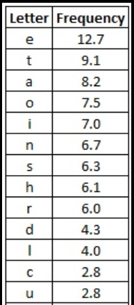

# Monoalphabetic Substitution Ciphers

!!!ghost Disclaimer
Information and images are taken from [Crypto Corner](https://crypto.interactive-maths.com/). Additional sources are explicitly mentioned.
!!!

A monoalphabetic substitution is a cipher in which each occurrence of a plaintext symbol is replaced by a corresponding ciphertext symbol to generate ciphertext. ([Cornell University, *Math 135*, 2006](https://uregina.ca/~kozdron/Teaching/Cornell/135Summer06/Handouts/monoalphabet.pdf))

!!!danger
Applying a monoalphabetic substitution cipher multiple times is equivalent to applying it once!
!!!

!!!primary Notations
$E$ is the encryption function. $D$ is the decryption function.
!!!

## Caesar cipher

### Encryption

Considering the 26-letter English alphabet and an integer key, $0 <= K < 26$, encryption is done by shifting the alphabet to the left by $K$ positions. For example, with $K = 3$, "A" would be encrypted to "D".

Mathematically, if $i$ is the i-th letter in the zero-indexed English alphabet, then $E(i, K) = i + K \pmod{26}$

### Decryption

Decryption is the reverse process, that is shifting the alphabet to the right by $K$ positions.

$D(i, K) = i - K \pmod{26}$

### Observations

Modulo is needed because we are stuck in the 26-letter alphabet. Thus, a key of 1 is the same as a key of 27 because $1 \pmod{26} = 27 \pmod{26}$.

Regarding the fact that applying a monoalphabetic substitution cipher multiple times is equivalent to applying it once:

$$ E(E(i, K_{1}), K_{2}) = (i + K_{1} \pmod{26}) + K_{2} \pmod{26} = i + K_{1} + K_{2} \pmod {26} = i + K_{3} \pmod{26} $$

## Affine cipher

The affine cipher is a generalization of the caesar cipher. Now, the alphabet is of dimension $m$, and there are two keys: $a$ and $b$. 

### Encryption

$E(x,a,b) = ax + b \pmod{m}$

### Decryption

$D(x,a,b) = a^{-1}(x - b) \pmod{m}$

!!!danger
$a$ and $m$ have to be coprime, otherwise we can't compute $a^{-1}$.
!!!

Explanation (for details, see notes on [modular arithmetics](/notes/cryptography/appendix/00-modular)):

$$
\begin{align}
D(E(x,a,b),a,b) &= a^{-1}(E(x,a,b) - b) \pmod{m}\notag\\
&= a^{-1}(ax + b \pmod{m}) - b) \pmod{m}\notag\\
&= a^{-1}(ax + b - b) \pmod{m}\notag\\
&= a^{-1}ax \pmod{m}\notag\\
& = x \pmod{m}\notag
\end{align}
$$

### Observations

The Caesar cipher is the affine cipher with $a = 1$ (and $m = 26$, if we only use letters from the English alphabet).

If, for example, $m=26$, the number of possible values for $a$ is $\varphi(26)=12$ (see notes on [Euler's totient function](/notes/cryptography/appendix/00-modular/#eulers-totient-function))). $b$ can be any value that satisfies $0 <= b < 26$. So the possible number of valid affine cipher keys if $m=26$ is $12 \cdot 26 = 312$.

## Frequency Analysis

The method behind frequency analysis is based on the letter frequency of the English alphabet. For example, the most common letter in the English alphabet is "E". Thus, if a message encrypted with a monoalphabetic substitution cipher is long enough, we can pretty safely assume that its most common letter is the ciphertext for "E". We can repeat this process for every letter in the frequency distribution (see image below).

!!!primary
Every single type of monalphabetic substitution is easily breakable using frequency analysis.
!!!