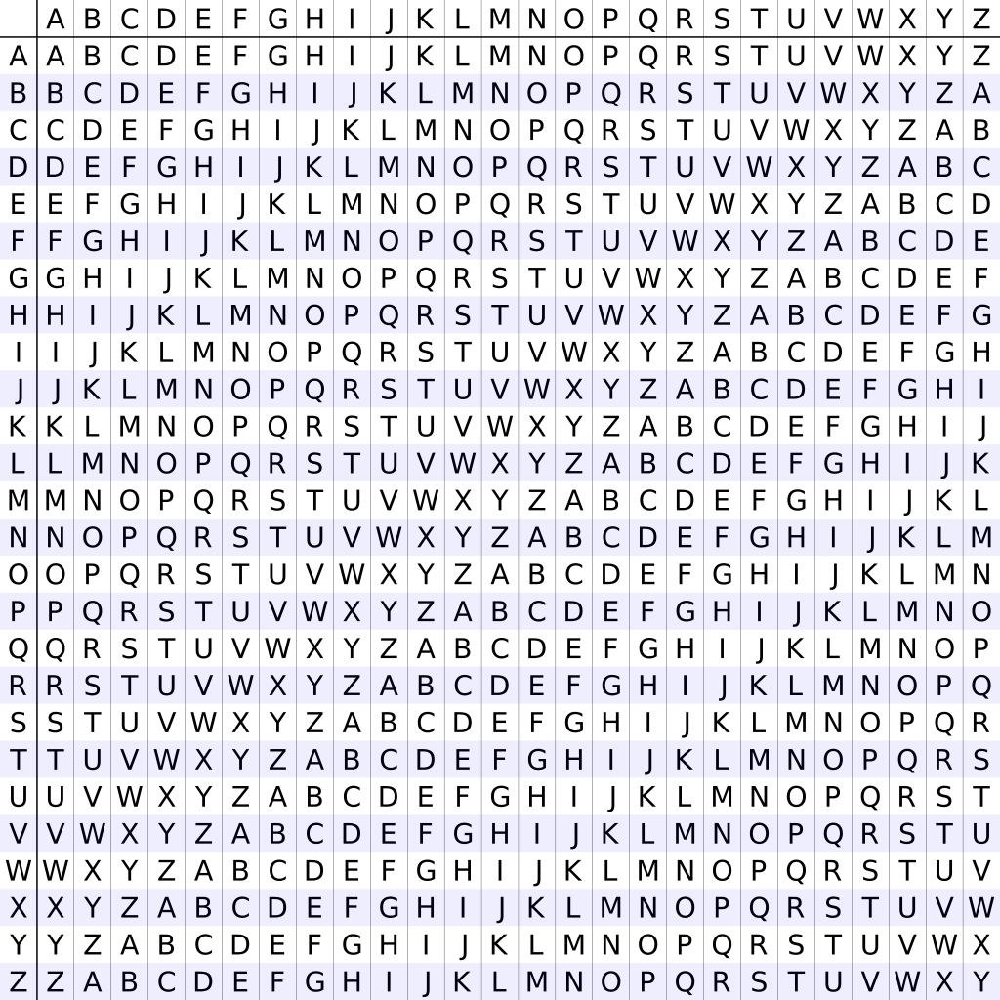

# Vigenère Cipher

!!!ghost Disclaimer
Information and images are taken from [Crypto Corner](https://crypto.interactive-maths.com/). Additional sources are explicitly mentioned.
!!!


The Vigenère cipher is a polyalphabetic substitution cipher, meaning it uses multiple substitution alphabets. The cipher makes use of a table of alphabets called *tabula recta*. The tabula recta consists of the English alphabet written 26 times in different rows, each row being shifted one position to the left compared to the previous row (the first row is just the plain English alphabet). So, all rows actually make up the 26 possible Caesar cipher alphabets, starting from the first one with shift 0 and ending with the last one with shift 25. Yet again, the cipher alphabet is made up of the 26 English letters.

The rows and columns are indexed using the letters of the alphabet. Thus, the first row corresponds to A, the last one to Z and the same for columns.



## Encryption

The key used for encryption is a word. To encrypt a message, we place the key under the plaintext (from which spaces and other non-alphabet characters were stripped) and we repeat the key until we "cover" all of the plaintext message. For example, if the plaintext message is "a simple example" and the key is "battista", we would get this:

```
ASIMPLEEXAMPLE
BATTISTABATTIS
```

Each pair of message and key characters gets encrypted to the character in tabula recta that corresponds to the row indicated by the plaintext character and the column indicated by the key character.

```
ASIMPLEEXAMPLE
BATTISTABATTIS
==============
BSBFXDXEYAFITW
```

Mathematically speaking, Vigenère encryption $E$ using key $K$ can be written as:

$$ C_{i} = E_{k}(M_{i}) = M_{i} + K_{i} \pmod{26} $$

where $M = M_{1}M_{2}...M_{n}$ is the plaintext, $K = K_{1}K_{2}...K_{n}$ is the repeated key, and $C = C_{1}C_{2}...C_{n}$ is the ciphertext.


## Decryption

Decryption is done by reverting the process for encryption. We write the repeated key under the ciphertext and each pair of ciphertext and key characters and perform the following:
* identify the column with the corresponding key character "index" (letter index)
* the row "index" which contains the ciphertext is the plaintext character

Mathematically speaking,

$$ M_{i} = C_{i} - K_{i} \pmod{26} $$

## Breaking the Unbreakable Cipher

For long, the Vigenère cipher was thought to be unbreakable. Its most important strength is the fact that it is immune to frequency analysis because multiple alphabets are used in encryption so a plaintext character doesn't always get encrypted to the same ciphertext character. Its weakness lies in the repetition of the key. The cipher was broken by Friedrich Kasisksi.
