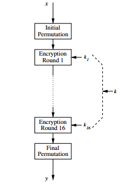
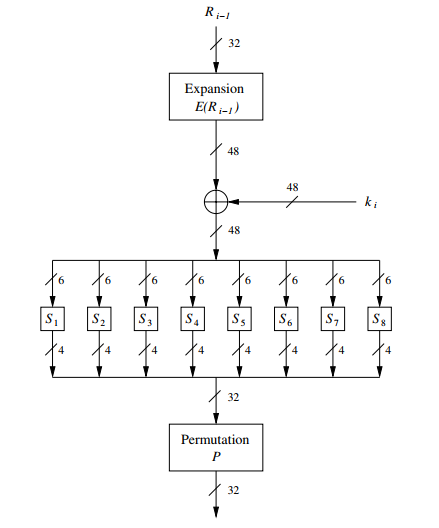

# DES

!!!ghost Disclaimer
Information and images are taken from [Understanding Cryptography](http://swarm.cs.pub.ro/~mbarbulescu/cripto/Understanding%20Cryptography%20by%20Christof%20Paar%20.pdf). Additional sources are explicitly mentioned.
!!!

!!!Confusion and Diffusion

**Confusion** is an encryption operation where the relationship between key and ciphertext is obscured. Confusion can be achieved through substitution.

**Diffusion** is an encryption operation where the influence of one plaintext symbol is spread over many ciphertext symbols with the goal of hiding statistical properties of the plaintext. Diffusion can be achieved through transposition.

Ciphers which only perform confusion are not secure. Neither are ciphers which only perform diffusion. However, through the concatenation of such operations, a strong cipher can be built.
!!!

## Overview

DES is a symmetric block cipher with 64-bit block size and 56-bit key size.

DES is an iterative algorithm, with encryption being handled in 16 rounds each performing the same operation. The subkey $k_{i}$ for each round is derived from the main key $k$. The underlying structure of DES is called a *Feistel network*.

After the initial bitwise permutation $IP$ of a 64-bit plaintext $x$, the plaintext is split into two halves $L_0$ and $R_0$. These two 32-bit halves are the input to the Feistel
network, which consists of 16 rounds. The right half $R_i$ is fed into the function $f$. The output of the $f$ function is XORed (denoted by the symbol $\oplus$) with the left 32-bit half $L_i$. Finally, the right and left half are swapped. This process repeats in the next round. Generally:

$$
\begin{gather}
L_i = R_{i-1}\notag\\
R_i = L_{i-1} \oplus f(R_{i-1}, k_i)\notag\\
\end{gather}
$$

After round 16, the 32-bit halves $L_{16}$ and $R_{16}$ are swapped again, and the final permutation $IP^{−1}$ is the last operation of DES. As the notation suggests, $IP^{−1}$ is the inverse of the initial permutation $IP$. In each round, a round key $k_{i}$ is derived from the main 56-bit key using what is called the *key schedule*.

## Internal Structure

### Initial and final permutations

These are just basic bitwise permutations. Both permutations do not increase the security of DES at all. The exact rationale for the existence of these two permutations is not known, but it seems likely that their original purpose was to arrange the plaintext, ciphertext and bits in a bytewise manner to make data fetches easier for 8-bit data busses, which were the state-of-the-art register size in the early 1970s.

### $f$ function

The $f$ function plays a crucial role for the security of DES. In round $i$ it takes the right half $R_{i−1}$ of the output (32 bits) of the previous round and the current round key $k_i$ as input. The output of the $f$ function is used as an XOR-mask for encrypting the left half input bits $L_{i−1}$.

In short, the steps performed are:
* expansion of the 32-bit input to 48 bits using a speciall type of permutation called *E-box*
* 48-bit result is XOR-ed with $k_{i}$
* result is divided in eight 6-bit blocks and fed into eight different $S\text{-}boxes$ (substitution boxes). Each S-box maps a 6-bit input to a 4-bit output, which causes **confusion**
* finally, the 32-bit (eight 4-bit S-box outputs) output is fed into a permutation called $P$, which causes **diffusion**

!!!
The S-box is the most crucial element of DES because it introduces non-linearity
!!!

### Key schedule

The key schedule derives 16 round keys $k_i$, each consisting of 48 bits, from the original 56-bit key. Another term for round key is subkey. First, note that the DES input key is often stated as 64-bit, where every eighth bit is used as an odd parity bit over the preceding seven bits. It is not quite clear why DES was specified that way. In any case, the eight parity bits are not actual key bits and do not increase the security. DES is a 56-bit cipher, not a 64-bit one.

## Decryption

One advantage of DES is that decryption is essentially the same function as encryption. This is because DES is based on a Feistel network.

## Security 

DES is not considered secure anymore because of the small key size. However, 3DES (triple-DES, which means three successive DES applications) is still used and viable.