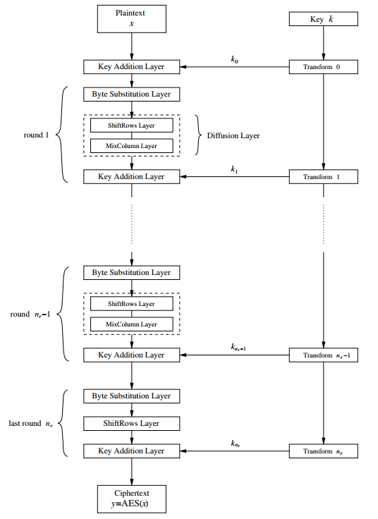

# AES

!!!ghost Disclaimer
Information and images are taken from [Understanding Cryptography](http://swarm.cs.pub.ro/~mbarbulescu/cripto/Understanding%20Cryptography%20by%20Christof%20Paar%20.pdf). Additional sources are explicitly mentioned.
!!!

## Overview

AES is a symmetric block cipher with 128-bit block size and three possible key lenghts: 128, 192, and 256-bit. AES does not have a Feistel structure, in contrast to DES. Feistel networks don't encrypt whole blocks in each iteration (only half-blocks), however, AES does encrypt whole 128-bit blocks in each iteration. Encryption is done in rounds, just like DES. The number of rounds depends on the key length:

Key length | # rounds = $n_r$ {class="compact"}
---        | ---
128-bit    | 10  
192-bit    | 12
256-bit    | 14

AES is based on three types of layers. Each round, with the exception of the first, employs all three layers. Additionally, the last round doesn't make use of the *MixColumn* transformation for symmetry purposes. The three layers are:
1. **Key Addition layer**: a 128-bit subkey derived from the main key is XORed to the current state
2. **Byte Substitution layer** (S-box): each state element is non-linearly transformed using look-up tables. This produses **confusion**
3. **Diffusion layer**:
   1. *ShiftRows sublayer*: permutes data on byte level
   2. *MixColumn sublayer*: mixes blocks of four bytes

## Internal Structure

### Byte substitution layer

This is the first layer in each round. It can be viewed as a row of 16 parallel S-boxes, each with 8 bits as input and output. All S-boxes are identical, unlike DES, where eight different S-boxes are used. The S-box is also a bijective mapping, which means it's reversible.

!!!
The S-box is the only non-linear element of AES. That is, $S\text{-}box(A) + S\text{-}box(B) \neq S\text{-}box(A + B)$ for two states $A$ and $B$.
!!!

### Diffusion layer

In AES, the Diffusion layer consists of two sublayers, the ShiftRows transformation and the MixColumn transformation. The Diffusion layer performs a linear operation.

#### ShiftRows sublayer

The ShiftRows transformation cyclically shifts the second row of the state matrix by three bytes to the right, the third row by two bytes to the right and the fourth row by one byte to the right. 

#### MixColumn sublayer

The MixColumn step is a linear transformation which mixes each column of the state matrix. Since every input byte influences four output bytes, the MixColumn operation is the major diffusion element in AES.

### Key addition layer

The two inputs to the Key addition layer are the current 16-byte state matrix and a subkey which also consists of 16 bytes (128 bits). The two inputs are combined through a bitwise XOR operation.

### Key schedule

The key schedule takes the original input key (of length 128, 192 or 256 bit) and derives the subkeys used in AES. Note that an XOR addition of a subkey is used both at the input and output of AES.

!!!
The number of subkeys is equal to the number of rounds plus one, due to the key needed for key whitening in the first key addition layer.
!!!

## Decryption

Because AES is not based on a Feistel network, all layers must actually be inverted, i.e., the Byte Substitution layer becomes the Inv Byte Substitution layer, the ShiftRows layer becomes the Inv ShiftRows layer, and the MixColumn layer becomes Inv MixColumn layer.